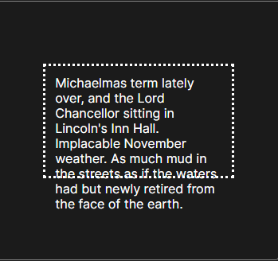
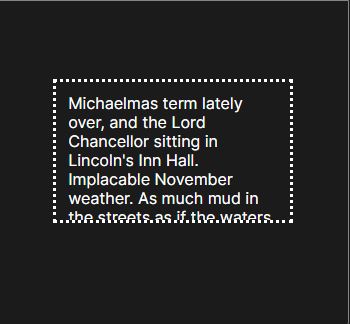
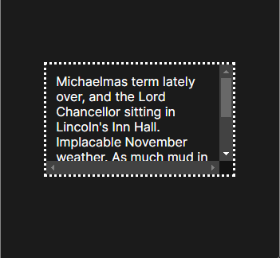
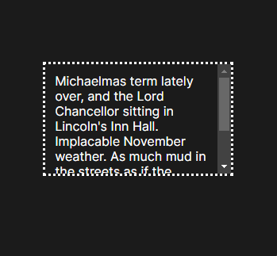

# CSS BOX MODELS

## What is a CSS box model?
It is a container that contains multiple properties including borders, margin, padding, and the content itself. It is used to create the design and layout of web pages.  

It may also refer to how HTML elements are modeled in [browser engines](https://en.wikipedia.org/wiki/Browser_engine) and how the dimensions of those HTML elements are derived from CSS properties. 

Here each element is supplied as a square prism by the webbrowser.  

There are two types of css box models, that is, __*Block*__ and __*inline boxes*__. The type refers to how the box behaves in terms of page flow and in relation to other boxes on the page. Boxes have an inner display type and an outer display type
 
## Elements of a CSS box model

Every box is composed of four parts (or areas), defined by their respective edges: the content are __*edge,  padding edge, border edge, and margin edge*__. Others can refer to the four parts as __*content, padding, border, and margin.*__

Below is a visual representation of the box model;  


### Let's Review each part / component

1. **Content** - The content area consists of content like image, text, or other forms of media content. The *height* and *width* properties help to modify the box dimensions. 

1. **Padding** - The padding area is the space around the content area and within the border-box. It can be applied to all sides of the box or to the specific, selected side(s) - *top, right, bottom, and/or left*.

1. **Border** - The border area surrounds the padding and the content, and can be applied to all the sides of the box or to selected side(s) - *top, right, bottom, and/or left.*

1. **Margin** - The margin area consists of space between the border and the margin. The margin does not possess its own background color and is completely transparent. It shows the background color of the element, like the body element.


## What can be placed in a box model?

**Everything in CSS is a box,** as you can constrain the size of these boxes by assigning values of width and height (or inline-size and block-size ).

**NOTE:** The outline property is not part of the CSS Box Model as outlines do not take up any space.


[__*Overflow*__](https://developer.mozilla.org/en-US/docs/Web/CSS/CSS_overflow) happens when there is too much content to fit in a box. That is, when an element's content does not fit entirely inside the element box. 

An example of an overflow is as follows;


Scrollable overflow is the content that appears outside the element box for which you might want to add a scrolling mechanism.

Generally, CSS provides various **overflow properties** to manage overflow.

### Overflow Properties

<details> 
<summary>visible</summary>  

  

```css
/* Keyword value */
overflow: visible;
```  

Overflow content is not clipped and may be visible outside the element's padding box. The element box is not a scroll container. This is the default value of the overflow property.
</details>

<details>
<summary>hidden</summary>

  

```css
/* Keyword value */
overflow: hidden visible; 
```  
or
```css
/* Keyword value */
overflow: hidden;  /*Nothing is displayed*/
```

Overflow content is clipped at the element's padding box. There are no scroll bars, and the clipped content is not visible (i.e., clipped content is hidden), but the content still exists. User agents do not add scroll bars and also do not allow users to view the content outside the clipped region by actions such as dragging on a touch screen or using the scroll wheel on a mouse. The content can be scrolled programmatically (for example, by linking to anchor text, by tabbing to a hidden yet focusable element, or by setting the value of the scrollLeft property or the scrollTo() method), in which case the element box is a scroll container.
</details>

<details>
<summary>clip</summary>

  

```css
/* Keyword value */
overflow: clip;
```  

Overflow content is clipped at the element's overflow clip edge that is defined using the overflow-clip-margin property. As a result, content overflows the element's padding box by the *<length>* value of overflow-clip-margin or by 0px if not set. Overflow content outside the clipped region is not visible, user agents do not add a scroll bar, and programmatic scrolling is also not supported. No new formatting context is created. To establish a formatting context, use overflow: clip along with display: flow-root. The element box is not a scroll container.
</details>

<details>
<summary>scroll</summary>

  

```css
/* Keyword value */
overflow: scroll;
```  

Overflow content is clipped at the element's padding box, and overflow content can be scrolled into view using scroll bars. User agents display scroll bars in both horizontal and vertical directions if only one value is set, whether or not any content is overflowing or clipped. The use of this keyword, therefore, can prevent scroll bars from appearing and disappearing as content changes. Printers may still print overflowing content. The element box is a scroll container.
</details>

<details>
<summary>auto</summary>

  

```css
/* Keyword value */
overflow: auto;
```  

Overflow content is clipped at the element's padding box, and overflow content can be scrolled into view. Unlike scroll, user agents display scroll bars only if the content is overflowing and hide scroll bars by default. If content fits inside the element's padding box, it looks the same as with visible but still establishes a new formatting context. The element box is a scroll container.
</details>

***

Congratulations for completing reading the readme file 👏🏽, you have now gained a very strong understanding of the CSS Box Model layout🎉.

## Conclusion

The CSS box model is an integral component of design, and possessing a good working-level command over it is important to help you to better align the elements on a web page.