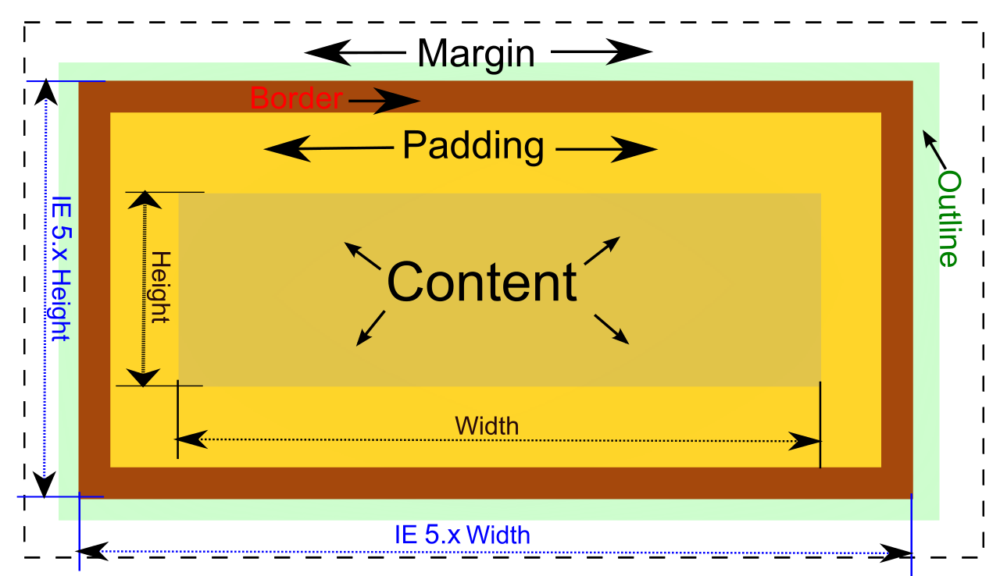
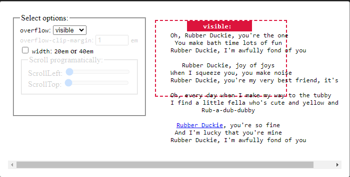

# CSS BOX MODELS

## What is a CSS box model?
It is a container that contains multiple properties including borders, margin, padding, and the content itself. It is used to create the design and layout of web pages.  

It may also refer to how HTML elements are modeled in [browser engines](https://en.wikipedia.org/wiki/Browser_engine) and how the dimensions of those HTML elements are derived from CSS properties. 

Here each element is supplied as a square prism by the webbrowser.  

## Elements of a CSS box model

Every box is composed of four parts (or areas), defined by their respective edges: the content are __*edge,  padding edge, border edge, and margin edge*__. Others can refer to the four parts as __*content, padding, border, and margin.*__

Below is a visual representation of the box model;  

### Let's Review each part / component

1. **Content** - The content area consists of content like image, text, or other forms of media content. The *height* and *width* properties help to modify the box dimensions. 

1. **Padding** - The padding area is the space around the content area and within the border-box. It can be applied to all sides of the box or to the specific, selected side(s) - *top, right, bottom, and/or left*.

1. **Border** - The border area surrounds the padding and the content, and can be applied to all the sides of the box or to selected side(s) - *top, right, bottom, and/or left.*

1. **Margin** - The margin area consists of space between the border and the margin. The margin does not possess its own background color and is completely transparent. It shows the background color of the element, like the body element.

## What can be placed in a box model?

**Everything in CSS is a box,** as you can constrain the size of these boxes by assigning values of width and height (or inline-size and block-size ).

**NOTE:** The outline property is not part of the CSS Box Model as outlines do not take up any space.

[__*Overflow*__](https://developer.mozilla.org/en-US/docs/Web/CSS/CSS_overflow) happens when there is too much content to fit in a box. That is, when an element's content does not fit entirely inside the element box. 

Scrollable overflow is the content that appears outside the element box for which you might want to add a scrolling mechanism.

Generally, CSS provides various tools to manage overflow such as;  

An example of an overflow is as follows;

Congratulations for completing reading the readme file 👏🏽, you have now gained a very strong understanding of the CSS Box Model layout🎉.

## Conclusion

The CSS box model is an integral component of design, and possessing a good working-level command over it is important to help you to better align the elements on a web page.